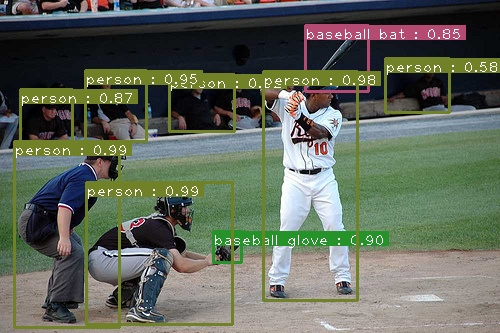
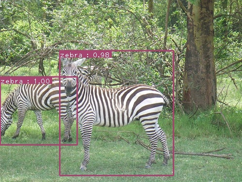
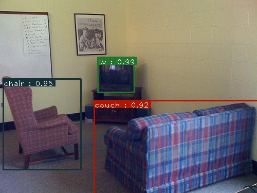
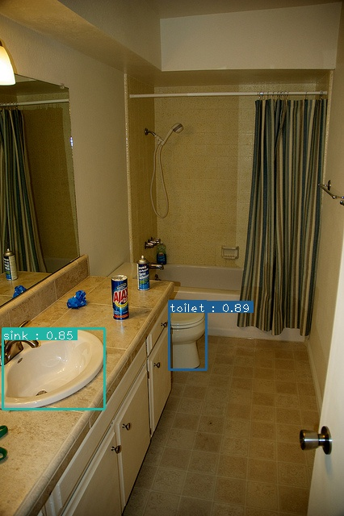
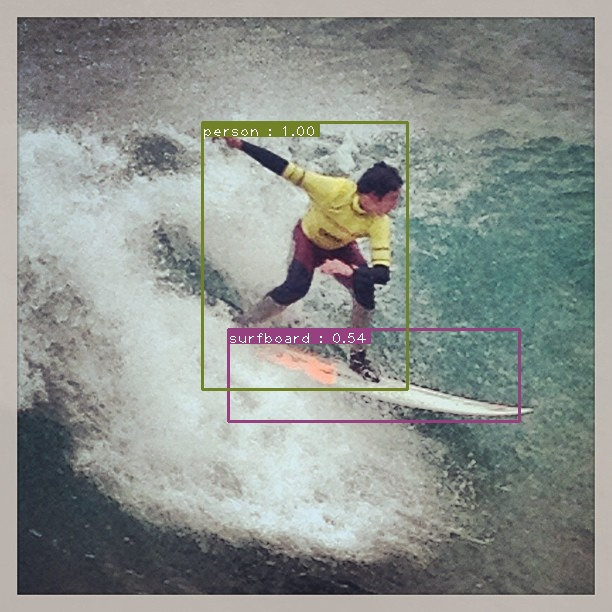
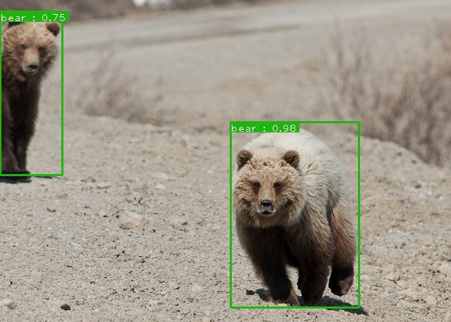
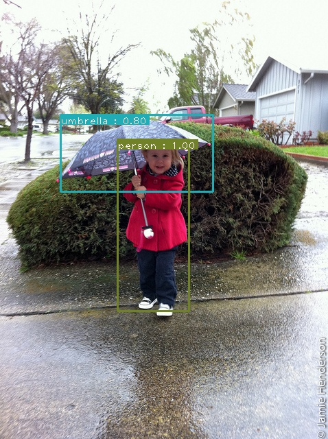
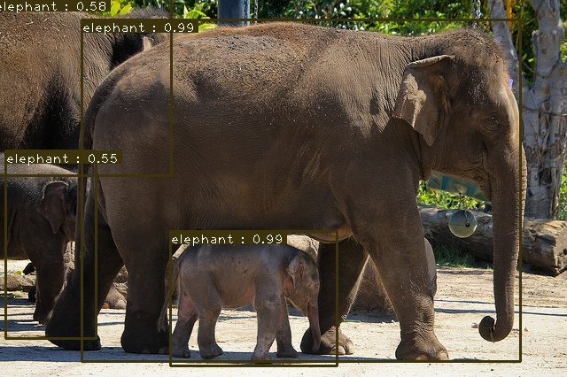

# SSD: Single Shot MultiBox Detector

## Introduction

Here is my pytorch implementation of 2 models: **SSD-Resnet50** and **SSDLite-MobilenetV2**. These models are based on original model (SSD-VGG16) described in the paper [SSD: Single Shot MultiBox Detector](https://arxiv.org/pdf/1512.02325). **This implementation supports mixed precision training**.
<p align="center">
  <br/>
  <i>An example of SSD Resnet50's output.</i>
</p>

## Motivation

Why this implementation exists while there are many ssd implementations already ?

I believe that many of you when seeing this implementation have this question in your mind. Indeed there are already many implementations for SSD and its variants in Pytorch. However most of them are either: 
- over-complicated
- modularized
- many improvements added
- not evaluated/visualized

The above-mentioned points make learner hard to understand how original ssd looks like. Hence, I re-implement this well-known model, focusing on simplicity. I believe this implementation is suitable for ML/DL users from different levels, especially beginners. In compared to model described in the paper, there are some minor changes (e.g. backbone), but other parts follow paper strictly.  

## Datasets


| Dataset                | Classes |    #Train images      |    #Validation images      |
|------------------------|:---------:|:-----------------------:|:----------------------------:|
| COCO2017               |    80   |          118k         |              5k            |

  
- **COCO**:
  Download the coco images and annotations from [coco website](http://cocodataset.org/#download). Make sure to put the files as the following structure (The root folder names **coco**):
  ```
  coco
  ├── annotations
  │   ├── instances_train2017.json
  │   └── instances_val2017.json
  │── train2017
  └── val2017 
  ```
## Docker

For being convenient, I provide Dockerfile which could be used for running training as well as test phases

Assume that docker image's name is **ssd**. You already created an empty folder name **trained_models** for storing trained weights. Then you clone this repository and cd into it.

Build:

`docker build --network=host -t ssd .`

Run:

`docker run --rm -it -v path/to/your/coco:/coco -v path/to/trained_models:/trained_models --ipc=host --network=host ssd`

## How to use my code

Assume that at this step, you either already installed necessary libraries or you are inside docker container

Now, with my code, you can:

* **Train your model** by running `python -m torch.distributed.launch --nproc_per_node=NUM_GPUS_YOU_HAVE train.py --model [ssd|ssdlite] --batch-size [int] [--amp]`. You could stop or resume your training process whenever you want. For example, if you stop your training process after 10 epochs, the next time you run the training script, your training process will continue from epoch 10. mAP evaluation, by default, will be run at the end of each epoch. **Note**: By specifying **--amp** flag, your model will be trained with mixed precision (FP32 and FP16) instead of full precision (FP32) by default. Mixed precision training reduces gpu usage and therefore allows you train your model with bigger batch size while sacrificing negligible accuracy. More infomation could be found at [apex](https://github.com/NVIDIA/apex) and [pytorch](https://pytorch.org/docs/stable/notes/amp_examples.html).
* **Test your model for COCO dataset** by running `python test_dataset.py --pretrained_model path/to/trained_model`
* **Test your model for image** by running `python test_image.py --pretrained_model path/to/trained_model --input path/to/input/file --output path/to/output/file`
* **Test your model for video** by running `python test_video.py --pretrained_model path/to/trained_model --input path/to/input/file --output path/to/output/file`

You could download my trained weight for SSD-Resnet50 at [link](https://drive.google.com/drive/folders/1_DYYDJUfwLIvGBDnM3hMFNgkVRZW6MgX?usp=sharing)
## Experiments

I trained my models by using NVIDIA RTX 2080. Below is mAP evaluation for **SSD-Resnet50** trained for 54 epochs on **COCO val2017** dataset 
<p align="center">
  <br/>
  <i>SSD-Resnet50 evaluation.</i>
</p>
<p align="center">
  <br/>
  <i>SSD-Resnet50 tensorboard for training loss curve and validation mAP curve.</i>
</p>

## Results

Some predictions are shown below:

  

  

  


## References
- Wei Liu, Dragomir Anguelov, Dumitru Erhan, Christian Szegedy, Scott Reed, Cheng-Yang Fu, Alexander C. Berg "SSD: Single Shot MultiBox Detector" [SSD: Single Shot MultiBox Detector](https://arxiv.org/abs/1512.02325).

- My implementation is inspired by and therefore borrows many parts from [NVIDIA Deep Learning examples](https://github.com/NVIDIA/DeepLearningExamples/tree/master/PyTorch/Detection/SSD) and [ssd pytorch](https://github.com/qfgaohao/pytorch-ssd)
